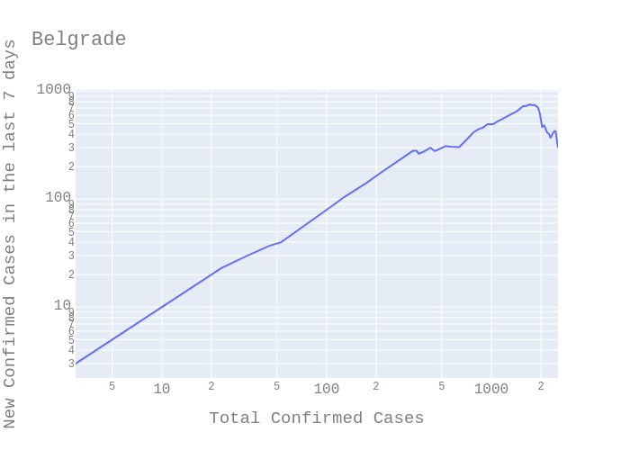
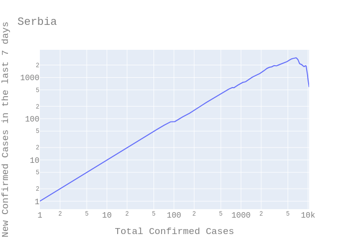

# COVID-19 data for Serbia using Plotly

This repository contains script that plots log-log diagram of number of people infecred by SARS-CoV-2 (Covid-19) virus.

Source of the data is:

* [Official Covid 19 information for Serbia](https://covid19.rs)
* [Covid 19 data for Serbia](https://covid19.data.gov.rs/infected)
* [Wikipedia](https://en.wikipedia.org/wiki/2020_coronavirus_pandemic_in_Serbia)

## How to run?

```bash
sudo apt-get update && sudo apt-get install python3.7-venv
python3.7 -m venv env
. env/bin/activate
pip install pip-tools
pip-compile --output-file requirements/base.txt requirements.in/base.txt
pip-sync requirements/base.txt
python src/covid.py
```

## The output

The Belgrade data is a bit off. The original dataset that I obtained from [covid19.data.gov.rs](https://covid19.data.gov.rs/infected) did not contain information for dates from 30.3.2020. - 15.4.2020. The missing data was calculated using available growth factor data and rounded up, but the numbers are off by 137 people (surplus). The error is because of rounding and the fact that the growth factor used is calculated for whole country and not the individual city.




